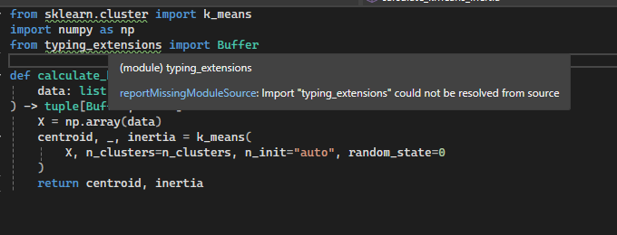

# CSnakes – Importing Python Packages with requirements.txt

A concise example showing how to import and manage Python libraries from C# using CSnakes.

## Overview
- Put your Python dependencies in a `requirements.txt` at the project root.
- Point CSnakes to a virtual environment folder you define (e.g., `.venv`) using `WithVirtualEnvironment(...)`.
- Enable `WithPipInstaller()` so packages from `requirements.txt` get installed automatically.

## Quick Start

1) Create `requirements.txt` at the project root (same folder as `Program.cs`)
    
        numpy
        pandas
        scikit-learn

2) Configure `Program.cs` to use a virtual environment and Pip installer (Python 3.12 redistributable)

        using CSnakes.Runtime;
        using Microsoft.Extensions.DependencyInjection;
        using Microsoft.Extensions.Hosting;

        var builder = Host.CreateDefaultBuilder(args)
            .ConfigureServices(services =>
            {
                var home = Path.Join(Environment.CurrentDirectory);
                var venv = Path.Join(home, ".venv");
                services
                    .WithPython()
                    .WithHome(home)
                    .WithVirtualEnvironment(venv)   // Points to your venv folder
                    .FromRedistributable("3.12")    // Uses embedded Python 3.12
                    .WithPipInstaller();            // Installs packages from requirements.txt
            });

        var app = builder.Build();

        var env = app.Services.GetRequiredService<IPythonEnvironment>();

        var home = Path.Join(Environment.CurrentDirectory);

        var advancedDemo = env.Kmeans();
        var data = advancedDemo.CalculateKmeansInertia([(100, 2), (200, 3)], 2);
        Console.WriteLine($"Inertia: {data.Item2}");
        app.Run();

3) Run the app
- Visual Studio: __Build Solution__ → __Start Debugging__ (F5)
- CLI: `dotnet run`

On first run CSnakes will:
- Download the Python 3.12 redistributable (if not cached)
- Create the `.venv` folder (if missing)
- Install packages listed in `requirements.txt` into `.venv`

## About the Python import warning (safe to ignore)
You may see an editor warning like “import could not be resolved” for modules such as `sklearn`. This is an IDE/intellisense warning and does not affect runtime. CSnakes installs and loads packages inside the `.venv` you configured, so the application runs correctly.

If you want to remove the warning in your editor, point the Python interpreter to the `.venv`:
- Choose the interpreter inside `.venv` (e.g., `.venv/Scripts/python.exe` on Windows).
- Or ignore the warning since CSnakes manages runtime dependencies.

## Performance and startup time
- Initial run can take significantly longer due to downloading Python and installing packages (depends on network and package size).
- Subsequent runs may have a longer startup than a pure .NET app because large Python packages (e.g., `numpy`, `pandas`, `scikit-learn`, or others you add) are loaded at process start. This does not affect correctness.
- To speed up:
  - Keep the `.venv` folder between runs.
  - Avoid unnecessary heavy packages in `requirements.txt`.
  - Warm up the app once on deployment so subsequent starts are faster.

## How It Works
- `WithVirtualEnvironment(path)`: Creates/uses an isolated Python environment at the given path (e.g., `.venv`)
- `WithPipInstaller()`: Installs and syncs packages from `requirements.txt` at the project root
- `FromRedistributable("3.12")`: Uses a managed, embedded Python runtime (no system Python required)

## Tips
- To force a clean reinstall, delete the `.venv` folder and run again
- Keep `requirements.txt` under source control for reproducible builds
- Change `FromRedistributable("3.12")` to target a different Python version if needed

## Environment
- Target: .NET 9, C# 13
- Works in Visual Studio 2022 or via `dotnet` CLI